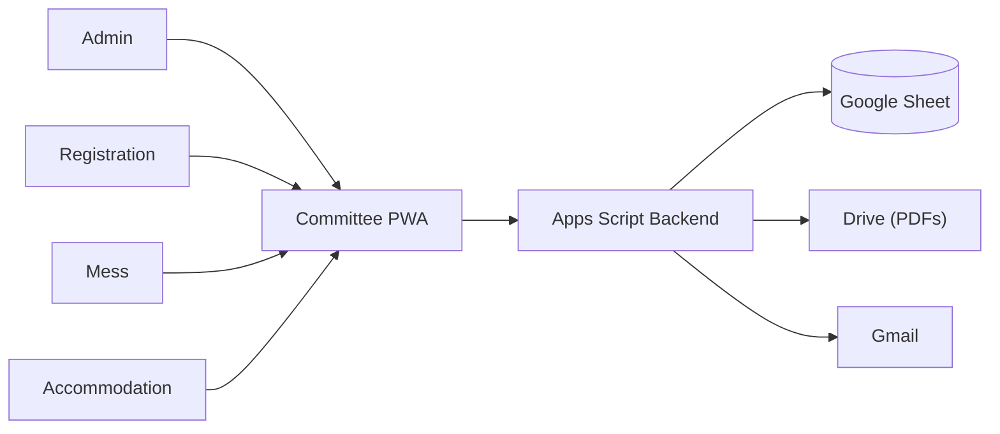
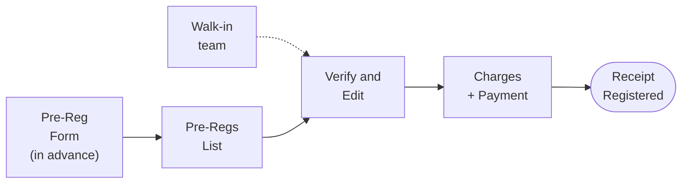
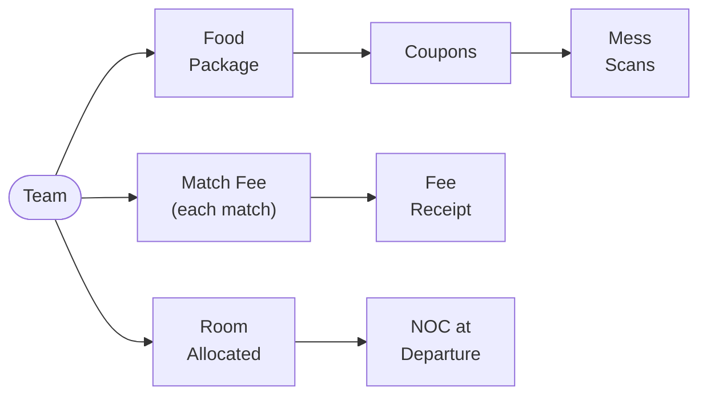
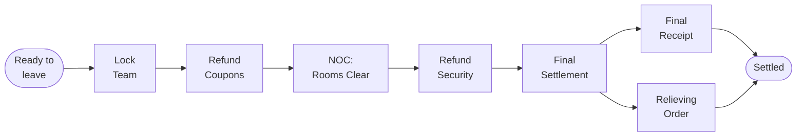

# HPUICK Tournament Management System — App Workflow

This document illustrates how a team moves through the HPU Inter-College
Kabaddi tournament system, from pre-registration to departure, and how the
four committee roles fit together.

## 1. System at a Glance

A Progressive Web App (installable on any phone or laptop) talks to a single
Apps Script backend, which reads and writes one Google Sheet acting as the
database, and generates PDFs (receipts, coupons, certificates, orders) that
can be emailed on the spot. Four roles — Admin, Registration, Mess,
Accommodation — log into their own dashboard, each seeing only what their
committee needs.

## 2. Team Journey: Pre-Registration to Receipt

Well before the tournament, a college submits a Google Form with its team's
details, plus how the team is travelling. On opening day, the Registration
Committee turns that into a paid, receipted team — a walk-in team with no
pre-registration joins the same flow, just from a blank form.

Verification matters because pre-registered details sometimes change by the
time the team arrives — the wizard opens pre-filled but every field stays
editable, so the operator corrects anything that's drifted before charging
the team.

## 3. During the Tournament

Once registered, three committees serve the team independently from the same
record, each seeing only their own slice of it — Mess never sees money,
Accommodation never sees charges.

## 4. Departure and Final Settlement

Departure reconciles everything a team was charged, refunded, and issued
across the whole tournament, and produces the two documents it takes home.

If Accommodation declines the NOC — a room key not yet returned, say —
Departure simply cannot finalize until it's granted; Registration sees the
decline reason directly on the team's own page, no extra screen to check.

## Role Summary

| Role | Owns |
|---|---|
| **Admin** | Rates & settings, committee accounts, reports, audit log |
| **Registration** | Pre-registration review, check-in, charges & payment, match fees, departure & final documents |
| **Mess** | Meal package sales, coupon scanning at each meal, food refunds |
| **Accommodation** | Room allocation, NOC issuance at departure |

Every step above writes to the same Sheet, and every generated document is
stored in Drive and logged — any action can be traced back through the Audit
Log later.
