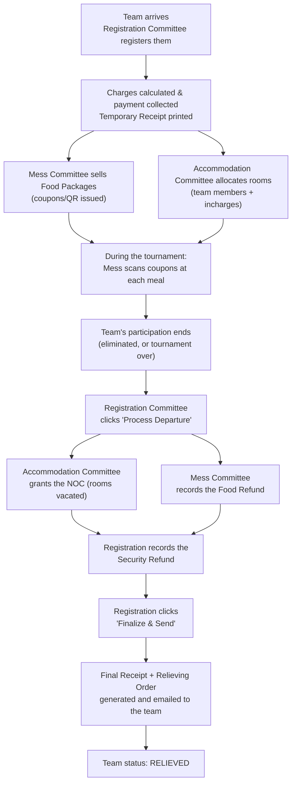

# HPUICK 2026 App User Guide

*A complete workflow guide for Admin, Registration Committee, Mess Committee, and Accommodation Committee*

This guide explains, step by step, how to use the HPU Inter-College Kabaddi (Men) Tournament 2026 management app — what each committee does in it, in what order, and how the four roles hand work off to each other. It is written for the people who will actually operate the app during the tournament, not for developers.

The app is a single website that looks different depending on who logs in. There is one login screen; after you log in, you only ever see the screens and buttons relevant to your own committee. Nothing described in another committee's section will appear on your own screen — this guide covers all four so that organizers and committee heads can see the whole picture, and so any committee member can also understand what happens on the other side of a hand-off (for example, why a food refund now has to be entered by Mess, not Registration).

---

## 1. Getting Started

### 1.1 Opening the app

The app is a website (a "Progressive Web App"). Open it in a phone or laptop browser at the address your Admin gives you. On a phone, after opening it once you can add it to your home screen (browser menu → "Add to Home Screen" / "Install App") so it opens like a normal app icon — this does not require a separate app-store download.

### 1.2 Logging in

You will be given:

- **A Login ID** (Registration, Mess, Accommodation) **or an Email address** (Admin), and
- **A password**

Enter these on the login screen and tap **Log In**. Your session stays active for **12 hours** — after that, or if you close the app for a long time, you'll be asked to log in again.

> **If you forget your password:** there is currently no "forgot password" self-service option. Contact your Admin — they will need to create a fresh account for you (the old one gets disabled). Ask your Admin to do this in advance if you're worried about remembering a password on a busy tournament day.

### 1.3 The four roles

Every user belongs to exactly one of these four roles, decided when the Admin creates the account:

| Role | Who this usually is | What they're responsible for |
|---|---|---|
| **Admin** | Tournament organizer / technical lead | Overall setup, user accounts, rates, reports, oversight |
| **Registration Committee** | The desk that registers colleges as they arrive | Team registration, charges, payments, temporary receipts, the departure/settlement process, final documents |
| **Mess Committee** | The dining hall / catering team | Meal timing status, scanning coupons to serve meals, selling food packages, **food refunds** |
| **Accommodation Committee** | Hostel/room-allocation team | Assigning rooms, tracking vacancies, issuing the Accommodation NOC (No Objection Certificate) that clears a team to leave |

A quick way to remember the hand-offs: **Registration** brings a team into the system and takes them out at the end; **Mess** feeds them and settles food refunds; **Accommodation** houses them and signs off that rooms have been vacated before departure.

---

## 2. The Big Picture: A Team's Journey Through the App

Every team that registers moves through the same overall journey. The diagram below shows the full path and which committee is responsible for each stage.

The rest of this guide walks through each box in detail, organized by committee. Section 9 walks through the departure stage (G–M) end to end, since it is the one part of the app where all three committees work together in sequence.

---

## 3. Admin Guide

The Admin dashboard is the control center for the whole tournament. It is the only role that can create user accounts, change financial rates, and see every report.

### 3.1 First-time setup

Before registration opens, the Admin should visit **Settings** and fill in:

- **Tournament Info** — Tournament Name, Organizer/College Name, District Address, Start Date, End Date. These four/five fields are printed on **every** document the app generates (receipts, coupons, NOC certificate, Final Receipt, Relieving Order), so get them right before teams start registering.
- **Rates & Security** — Breakfast/Lunch/Dinner rates, the Dari (bedding) rate per team member, and the flat Security amount per team.
- **Meal Timings** — the daily start/end time for Breakfast, Lunch, and Dinner, plus a grace period (in minutes) applied before and after each window. Mess's coupon-scanning screen uses this to know which meal is "currently being served."
- **Signatures & Seals** — upload PNG/JPEG images of the Registration Convener's signature, the Principal's signature, and the Principal's seal. Once uploaded here, they are automatically stamped onto every Final Receipt, Relieving Order, and NOC Certificate from then on — no per-document upload needed. If you skip this, documents print a plain signature line instead (still valid, just handwritten instead of a scanned image).
- **Rooms** — add every room you plan to allocate (see 3.4).
- **User Accounts** — create a login for every Registration, Mess, and Accommodation Committee member who needs one (see 3.2).

### 3.2 Managing users

**Manage Users** → fill in Name, Role, a Login ID (or, for an Admin account, an Email address instead), and a Password → **Add User**.

Each user in the list can be **Disabled** (temporarily blocks their login without deleting their history) or re-**Enabled** later. There is no password-reset button — to recover a forgotten password, disable the old account and create a new one for that person.

### 3.3 Locking financial settings

Once registration is underway, use **Lock Financial Settings** on the Settings screen to freeze the Breakfast/Lunch/Dinner/Dari rates and the Security amount. While locked, nobody (including Admin) can change them from the screen — this exists specifically to prevent accidental rate changes mid-tournament from producing inconsistent charges between teams registered before and after the change. Unlock only if you have a deliberate reason to change rates.

### 3.4 Rooms

**Rooms** lets you build the master list Accommodation Committee allocates from. Each room is one of two kinds:

- **Team rooms** — on-campus, for team members
- **Incharge rooms** — rest houses / hotels, for contingent incharges

Add each real room with its number, building/venue, floor, and capacity. Accommodation Committee can only allocate against rooms that exist here.

### 3.5 Dashboard and Reports

The **Admin Dashboard** (your home screen) shows a live summary: team counts by status, total contingent persons, packages sold and revenue, Dari/Security collected, refunds issued so far, room occupancy, and NOC counts.

**Reports** breaks this down into five tabs:

| Tab | Shows |
|---|---|
| Financial | Per-team Dari, Security, food revenue, refunds, and (once settled) Final Balance |
| Food | Per-team package count/revenue and meal Eligible/Served/Remaining/Refunded totals |
| Accommodation | Room occupancy and per-team room/NOC status |
| Departure | Every team's current status and who (if anyone) currently holds their departure lock |
| Final Statement | Only teams that have completed departure — the full settlement figures plus direct links to their Final Receipt and Relieving Order PDFs |

**Audit Log** shows the most recent 200 actions taken by any user across the whole app (who did what, when) — useful for tracing a dispute after the fact.

---

## 4. Registration Committee Guide

Registration is the entry and exit point for every team: you bring them into the system, and — working with Accommodation and Mess — you take them back out at the end.

### 4.1 Registering a new team

From your dashboard, **Register New Team** starts a 4-step wizard:

**Step 1 — Team Details.** College name, District name, number of team members, and one row per contingent incharge (Name, Designation, WhatsApp, Email). Mark exactly one incharge as **Primary contact**. Tick **Needs accommodation** for any incharge who requires a room (team members are assumed to all need rooms; this checkbox is specifically about incharges, who might be staying elsewhere).

**Step 2 — Charges.** Two checkboxes: **Dari Charges** and **Security (refundable)**. Untick either one if it genuinely doesn't apply to this team (for example, a team that already has its own bedding). Whatever you leave ticked is calculated and shown; whatever you untick shows as Rs 0 and won't appear on the temporary receipt.

> **Important — Dari and the Final Receipt:** the Dari figure calculated here is only for the *temporary* receipt at registration. At departure, the app **always** recalculates Dari automatically for the Final Receipt — rate × team members × the number of nights the team actually stayed (registration date to departure date) — regardless of what you ticked here. You cannot opt a team out of Dari charges on the Final Receipt; unticking it here only affects the temporary receipt shown at registration time.

**Step 3 — Payment.** Record how the total was received: Cash, Online/Bank Transfer, or Cheque.

**Step 4 — Temporary Receipt.** The app generates a PDF receipt automatically. **View / Download Receipt** to print or share it — this is the team's proof of registration and payment. Tap **Done** to finish.

### 4.2 Teams list and Team Detail

**Teams** lists every registered team with its Registration Number, College, District, contingent size, and current status. Tap any row to open **Team Detail**, which is the hub you'll return to constantly — it shows the team's incharges, charges, receipt link, the Accommodation Committee's NOC decision (once made), and buttons to:

- **Food Packages** — sell additional meal packages (see 5.3 — Mess and Registration can both do this)
- **Process Departure** — start the departure/settlement workflow (see Section 9)
- **Resend Final Documents** — once a team has been finalized, re-send the Final Receipt + Relieving Order by email if the first attempt failed or the incharge needs another copy

### 4.3 Processing a departure (summary)

Full detail is in Section 9, since it involves all three committees. In short, as Registration you: click **Process Departure** to start it, wait for Accommodation's NOC and Mess's food refund, then record the Security Refund and click **Finalize & Send** once both are in place.

---

## 5. Mess Committee Guide

Mess Committee runs the dining hall and now also owns the food-refund decision (see 5.5 — this changed from an earlier version of the app where Registration entered it).

### 5.1 Current Meal

Shows every meal (Breakfast/Lunch/Dinner) and highlights which one is "currently serving" based on Admin's configured Meal Timings. Use **Mark ORDERED** / **Mark CLOSED** to record whether a given meal was actually prepared that day — this is reference information only (see 5.5's note on refunds), but it's useful record-keeping and other screens can see it.

### 5.2 Scan (serving a meal)

This is the screen your dining-hall gate staff use at every meal.

1. Point the camera at the coupon's QR code (most phones support this automatically), **or** use **Manual Entry** — type in the QR Token, or the printed **Coupon ID** if a physical coupon is lost/damaged and its QR can't be read.
2. The app shows the team's College, Package, how many are Eligible for this meal, how many have already been Served, and how many Remain.
3. Enter **how many people are eating right now** (a coupon covers a whole group in one scan — you do not need to scan once per person) and tap **Confirm**.
4. The Remaining count updates immediately. If someone tries to claim more than Remaining, the app rejects it and shows the real numbers so you can resolve it on the spot.

### 5.3 Today's Summary

A read-only table of every team's Eligible/Served/Remaining count for whichever meal is currently active — useful for a quick headcount check without scanning anything.

### 5.4 Selling Food Packages

Reached via **Teams → (select a team) → Food Packages** — the same screen Registration uses. A package always covers exactly three meals: **Dinner, then the next day's Breakfast and Lunch** (a fixed rolling window, never a custom combination). Team members are automatically included in every meal of a package; for each contingent incharge, tick which of the three meals they'll actually eat at mess (many incharges skip Breakfast/Dinner if they're staying at a hotel and only join for Lunch).

If a team arrives too late for that night's Dinner, **untick Dinner** when buying their first package — this excludes it entirely rather than charging for a meal they can't use. A second, third, etc. package for the same team automatically starts the day after the previous one ended, so coverage rolls forward with no gaps unless you deliberately pick a different date.

After purchase, the app issues one QR code covering the whole package and generates two PDFs: a **Digital Coupon** (emailed to the team, shown on a phone at the mess line) and a **Printed Coupon sheet** (one physical strip per eligible person, for teams that prefer paper). Both are available to **Resend** (email again) or **Reprint** (generate a fresh physical sheet, e.g. after coupons are lost) at any time from the same screen.

### 5.5 Food Refund — recording a refund for unused meals

This is Mess Committee's own screen, reached from **Teams → (select a team) → Food Refund**, once **Registration has clicked "Process Departure"** for that team (the button won't do anything useful before that — you'll see a message asking you to wait for Registration to start the departure process).

The screen lists every meal entitlement for the team: Date, Meal, Eligible, Served, Remaining, and Order Status (from 5.1). **The refund amount is entirely your judgment call** — the app shows a suggested figure (Remaining × the meal's rate) as a hint only; it never calculates or applies anything automatically. Type the amount you've decided on into the box next to each meal you're refunding and click **Record Food Refund**. Once a meal entitlement is refunded it's locked — it shows "Refunded" and can't be entered again.

You do not need to refund every meal at once, and you do not need to be the same person who clicked "Process Departure" — any Mess Committee member (or Admin) can record it once departure is underway.

This figure feeds directly into the team's Final Receipt at departure (Section 9) — Registration cannot see or change it, only read the total once you've entered it.

---

## 6. Accommodation Committee Guide

Accommodation Committee allocates rooms and, at the end, formally certifies that a team's rooms have been vacated (the NOC) — a required step before Registration can finalize a team's departure.

### 6.1 Dashboard: pending allocations

Your dashboard opens with two "needing accommodation" lists — **Teams** and **Incharges** — each showing how many people from that team/incharge group still need a room. Click **Allocate** next to a row to open the allocation form: pick a room from the dropdown (only rooms with spare capacity are listed) and how many people to place there. You don't have to allocate everyone to one room — allocate in batches across rooms as needed; the team will keep appearing on the pending list until fully housed.

### 6.2 Active allocations: reallocate and vacate

Below the pending lists, two more tables show everyone **currently** allocated a room. From here you can:

- **Reallocate** — move an existing allocation to a different room (e.g. a room needs to be freed up, or a mistake needs correcting)
- **Vacate** — release the allocation entirely, freeing that room capacity back up

### 6.3 Rooms reference

Two read-only tables (Team Rooms and Incharge Rooms) show every room Admin has set up, its capacity, and how much is currently remaining — useful for planning before you allocate.

### 6.4 The Accommodation NOC

Reached via **Teams → (select a team) → Accommodation NOC**. This is the certificate that says "this team's rooms have been checked and vacated — they are clear to leave." Registration cannot finalize a team's departure without it.

- **Grant NOC** — issues the certificate (a PDF is generated) and, as a convenience, automatically vacates every room still allocated to that team (both team-member and incharge rooms) so you don't have to manually vacate each one first.
- **Decline NOC** — if the rooms are **not** actually vacated/ready, decline instead of granting. Declining requires you to type a remarks note (e.g. "room key not yet returned") — Registration sees this remark on the team's detail screen, so they know exactly what's holding things up. You can revisit and Grant later once it's resolved; granting afterward clears the decline remark.

Once granted, **View NOC Certificate** shows the PDF at any time.

---

## 7. Departure Day: How the Three Committees Work Together

This is the most important cross-committee workflow in the app — it only works when Registration, Accommodation, and Mess each do their part, roughly in this order. It corresponds to boxes G–M in the diagram in Section 2.

**Step 1 — Registration initiates.** On the team's **Team Detail** screen, Registration clicks **Process Departure**. This "locks" the departure to that Registration operator (so two people can't process the same team's departure at once) and opens the Departure screen, which now shows: a read-only table of meal entitlements (for reference — the actual refund entry happens on Mess's own screen, see Step 2), and the Security section.

**Step 2 — Mess records the food refund.** Independently, any Mess Committee member goes to **Teams → (the same team) → Food Refund** and enters the refund amount for whichever unused meals they judge should be refunded (see 5.5). This can happen in parallel with Step 3 — Mess does not need to wait for Accommodation.

**Step 3 — Accommodation grants (or declines) the NOC.** Accommodation Committee visits the team's **Accommodation NOC** screen and grants it once rooms are confirmed vacated (see 6.4). If declined, Registration sees the decline reason on Team Detail and departure cannot proceed past this point until Accommodation grants it.

**Step 4 — Registration records the Security Refund.** Back on the Departure screen, once the NOC shows **NOC_GRANTED**, a Security Refund form appears (the Security Charged amount is shown as reference — you decide the actual refund amount, since deductions for damage etc. are possible). Enter the amount and click **Record Security Refund**. This can only be recorded once per team.

**Step 5 — Registration finalizes.** Once the NOC is granted, a **Finalize & Send** section appears showing a live settlement preview (Gross Food/Dari Charges and Net Charges — Dari is already the auto-calculated, always-included figure described in 4.1). Fill in:

- **Other Adjustments** — any extra manual deduction, if needed (defaults to 0)
- **Session** — Forenoon or Afternoon
- **Relieving Date** — the date the team is actually leaving (defaults to today)

Then click **Finalize & Send**. This single action:

1. Generates the **Final Receipt** PDF (Meal + Dari charges only — Security is deliberately **not** shown on this receipt, since it's a separate refundable deposit already settled in Step 4, not a charge)
2. Generates the **Relieving Order** PDF (certifies the team has completed participation and is formally relieved, with the Session and Relieving Date you entered)
3. Emails both PDFs together to the team's incharges
4. Releases the departure lock and sets the team's status to **RELIEVED**

You'll then see a confirmation screen with **View** links for both documents (so you can print them on the spot even if email fails) and the real email outcome. If the email didn't go through, or the incharge needs another copy later, use **Resend Email** right there, or **Resend Final Documents** from Team Detail at any later time — this re-sends the same two PDFs without ever regenerating them or changing any figures.

> **If you started a departure by mistake:** **Cancel Departure** on the Departure screen releases the lock without finalizing anything. Any refunds already recorded up to that point stay on record (they are not undone) — cancelling only means "not finalizing this attempt right now."

---

## 8. Documents the App Generates

| Document | Generated when | Who receives it | Contains |
|---|---|---|---|
| **Temporary Receipt** | End of team registration (Step 4 of the wizard) | Printed/shown to the team on the spot | Dari and Security charges actually ticked at registration |
| **Digital Coupon** | Every food package purchase | Emailed to the team | QR code, package number, meal window, primary incharge details |
| **Printed Coupon Sheet** | Every food package purchase (and any Reprint) | Printed physically | One strip per eligible person, same QR |
| **NOC Certificate** | Accommodation grants the NOC | Viewable in-app, linked from Team Detail | Certifies rooms vacated, signed by Accommodation Convener |
| **Final Receipt** | Registration clicks Finalize & Send | Emailed to the team + viewable in-app | Meal + Dari charges only (auto-calculated by nights stayed), net amount, amount in words — **security is not included** |
| **Relieving Order** | Registration clicks Finalize & Send | Emailed to the team + viewable in-app | Certifies the team completed participation and is relieved, with Session/Date and incharge names |

All PDFs are also reachable at any time from **Team Detail** (View buttons) and, for finalized teams, from Admin's **Reports → Final Statement** tab.

---

## 9. Frequently Asked Questions

**Q: I forgot my password. What do I do?**
There's no self-service reset. Ask your Admin to disable your old account and create a new one for you.

**Q: A meal package's coupon doesn't scan.**
Use the **Coupon ID** printed on the physical coupon in Mess's Scan screen's manual-entry section instead of the QR. If it's genuinely lost, use **Reprint** from the team's Food Packages screen to generate a fresh sheet — this does not create a new package or charge the team again.

**Q: Can Registration enter the food refund if Mess is busy?**
No — the app now enforces this at the server level, not just by hiding the button: only Mess Committee (or Admin) can record a food refund, even if a Registration operator is the one who started that team's departure.

**Q: Why doesn't the Final Receipt show the Security amount?**
By design. Security is a separate refundable deposit, settled in its own step (Section 7, Step 4) before the Final Receipt is even generated. The Final Receipt is specifically the players' Meal + Dari settlement.

**Q: A team lost their first match and is leaving after only 2 days, even though the tournament runs longer. What Dari do they owe?**
Exactly 2 nights' worth (rate × team members × 2) — the app calculates Dari from that specific team's actual registration date to its actual relieving date, never from the tournament's overall length. A team that stays the full tournament and one that leaves early after a loss are charged correctly and differently.

**Q: Two Registration operators both try to process the same team's departure.**
The second person is blocked with a clear message naming who currently holds it (an Admin account can always override and take over, if needed). This prevents two people from double-processing the same team's money.

**Q: The team's email never arrived.**
Use the **View** buttons (on the finalize confirmation screen, or from Team Detail any time after) to open the PDFs directly and print/save/forward them yourself, or use **Resend Email** / **Resend Final Documents** to try the email again — this never regenerates the documents or changes any figures, it only resends the same PDFs.

---

## 10. Appendix: Who Can Do What

| Action | Admin | Registration | Mess | Accommodation |
|---|:---:|:---:|:---:|:---:|
| Register a team, calculate charges, record payment | ✓ | ✓ | | |
| Sell / resend / reprint food packages | ✓ | ✓ | ✓ | |
| Scan coupons to serve meals | ✓ | | ✓ | |
| Mark a meal ORDERED / CLOSED | ✓ | | ✓ | |
| **Record a food refund** | ✓ | | ✓ | |
| Allocate / reallocate / vacate rooms | | | | ✓ |
| Grant / decline the Accommodation NOC | | | | ✓ |
| Initiate / cancel a departure | ✓ | ✓ | | |
| Record the security refund | ✓ | ✓ | | |
| Finalize & Send (Final Receipt + Relieving Order) | ✓ | ✓ | | |
| Resend Final Documents | ✓ | ✓ | | |
| View a team's identity/incharges | ✓ | ✓ | ✓ | ✓ |
| View a team's financial detail (charges, receipts) | ✓ | ✓ | | |
| Manage user accounts | ✓ | | | |
| Change rates / lock financial settings | ✓ | | | |
| Add rooms | ✓ | | | |
| View Reports / Dashboard / Audit Log | ✓ | | | |

*A blank cell means that role's screens simply don't offer the action — and the app also refuses it if attempted directly, so this table reflects what is actually enforced, not just what's shown on screen.*
